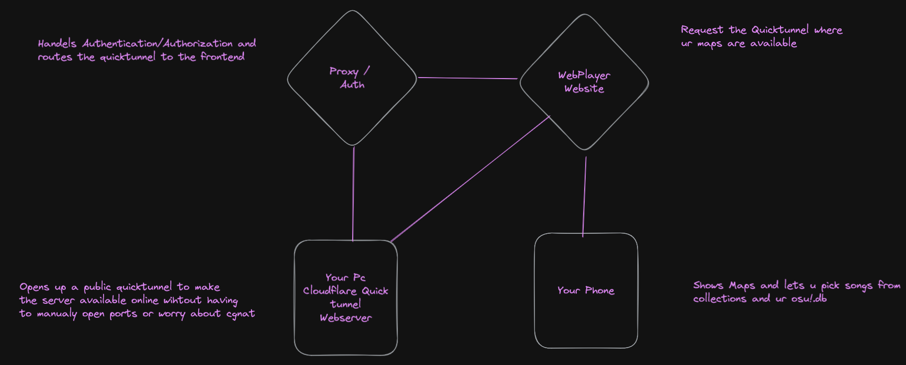
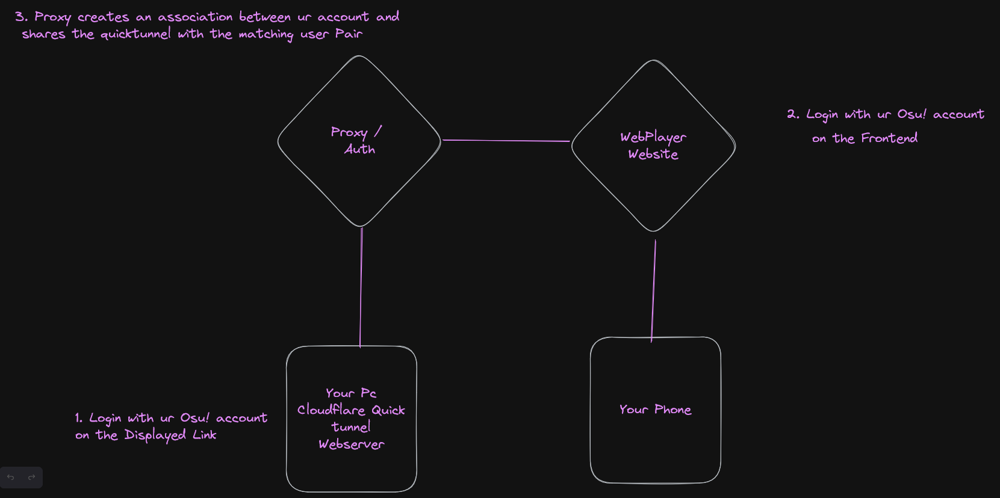
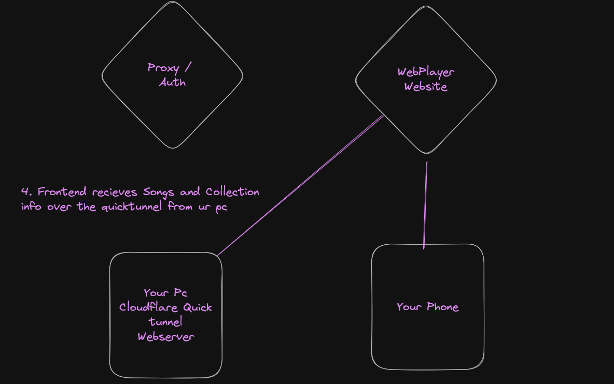

# How it works
To ensure users have secure access to their beatmaps through a shared website and prevent unauthorized users from accessing the Beatmaps. The following steps are taken. 

 
 Arcitectur Diagramm

The process begins by authenticating both the locally running web server (which exposes the beatmaps and collections) and the frontend interface with a proxy server. This ensures that only authorized users can access the beatmaps.
After authentication, the backend (the local web server) sends its quicktunnel base address to the proxy, which assosiates the endpoint with the logged in user.
 
 Authentication Process

Now the Frontend can receive the quicktunnel base address and start requesting beatmaps, collection and audio.
 
 Autorized Usage

This system is architected to provide convenient and consistent access to beatmaps by eliminating the need to worry about the changing domain names of Cloudflare quicktunnels. Aswell as the possiblity to share ur beatmaps with friends.
